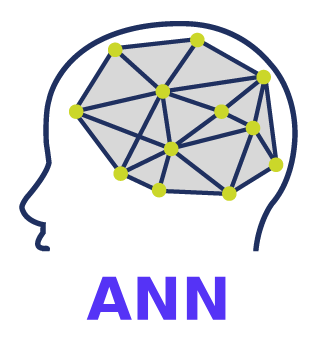
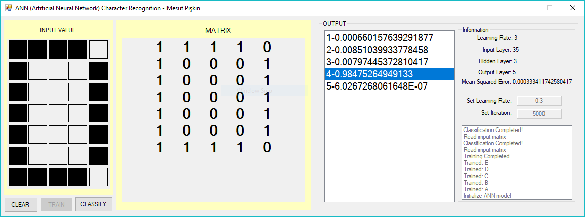

[English](./README.md) | Türkçe


<div align="center">

<h1 align="center">ANN (Yapay Sinir Ağı) ile Karakter Tanıma </h1>



</div>

### Yapay Sinir Ağı

Artificial neural networks (ANN) or connectionist systems are computing systems vaguely inspired by the biological neural networks that constitute animal brains. The neural network itself is not an algorithm, but rather a framework for many different machine learning algorithms to work together and process complex data inputs. Such systems "learn" to perform tasks by considering examples, generally without being programmed with any task-specific rules. For example, in image recognition, they might learn to identify images that contain cats by analyzing example images that have been manually labeled as "cat" or "no cat" and using the results to identify cats in other images. They do this without any prior knowledge about cats, for example, that they have fur, tails, whiskers and cat-like faces. Instead, they automatically generate identifying characteristics from the learning material that they process.

### Teknik Özellikler

- ANN: **Backpropagation**
- Sinir Ağı Giriş Sayısı: **35** (Piksel)
- Sinir Ağı Çıkış Sayısı: **5** (A, B, C, D, E, F)
- Sinir Ağı Gizli Katman Sayısı: **3**
- Sinir Ağı Aktivasyon Fonksiyonu: **Sigmoid**
- Programlama Dili: **C#**

### Nasıl Çalıştırırım?

- clone or download repository
```bash
git clone https://github.com/mesutpiskin/ANNCharacterRecognition.git
```
- Build project and run with **Visual Studio**
- Happy hacking.

### Kullanıcı Arayüzü

